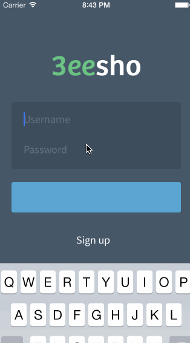

3eesho
=======
"Quinoa" Health App

This is an iOS 7 app designed for [3eesho](http://3eesho.com) (eyee-sho), an Arabic health and lifestyle social network. We created an app that can help people lose weight and live a healthier life by enabling them to record their activities and connecting them to experts.

Seeker Workflow
----------------
* Dashboard: provides an overview for goals and stats based on activities.
* Trainer
 * Trainer Browser: browse experts and select one.
 * Current Trainer: see the latest interactions and chat with the trainer.
* (+) Add activity
 * Record the current weight in pounds.
 * Add a physical activity duration in minutes.
 * Add a dietary activity by taking a picture of the meal.
* Profile
 * Activities: display my activities in reverse chronological order.
 * Edit Profile

Expert Workflow
----------------
* Activities
  * Display a list of activities from all of the clients.
  * Give "Kudos" to ones worthy of a compliment.
* Clients
  * Display a list of clients.
  * Chat with the clients.

